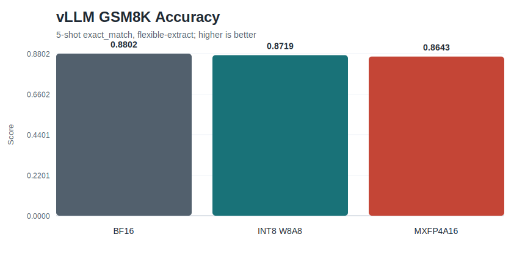
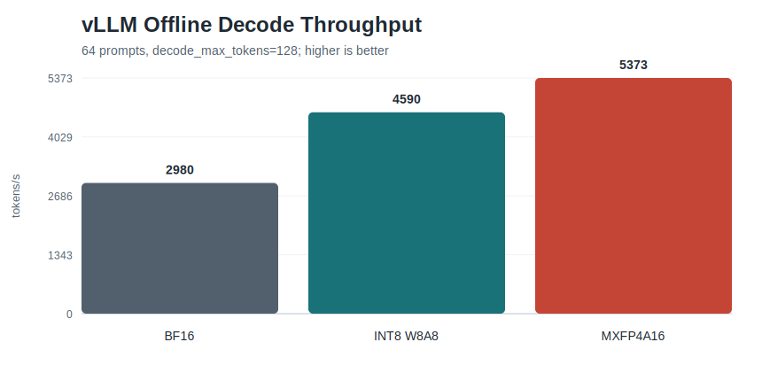
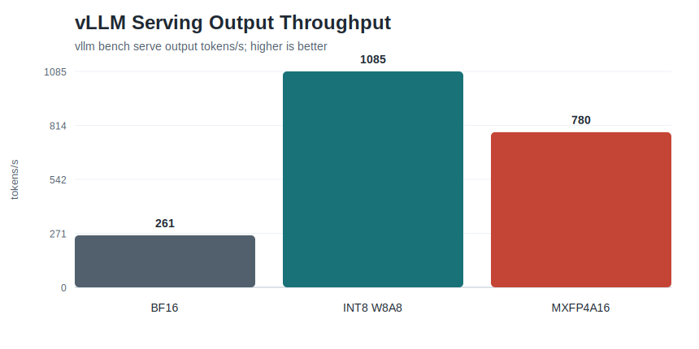
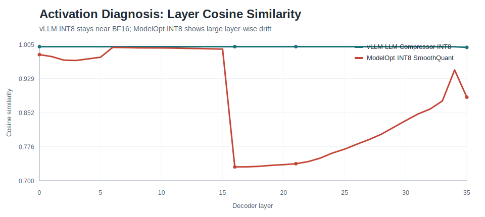
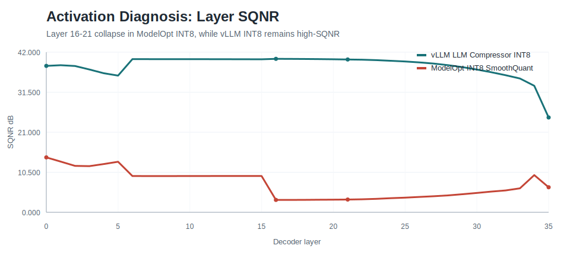

# Qwen3-8B 量化实验

一个围绕 **Qwen3-8B 后训练量化、推理性能与精度损失归因** 的可复现实验仓库。

本项目比较了三条主流工程链路：

- **vLLM + LLM Compressor**：BF16、INT8 W8A8、MXFP4A16。
- **Intel AutoRound**：INT8 W8A8、MXFP4 fakequant，并使用 vLLM 评测。
- **NVIDIA TensorRT-LLM + ModelOpt**：BF16 engine 与 INT8 SmoothQuant engine。

核心结论很直接：**Qwen3-8B 可以很好地承受 INT8 量化**，但本项目测试的 TensorRT-LLM / ModelOpt INT8 SmoothQuant 配置出现了显著精度下降。后续激活诊断、模块跳过和累计消融实验表明，主要问题来自 **`mlp.down_proj` 的 W8A8 量化误差**，而不是 Qwen3-8B 整体“不适合 INT8”。


## 为什么做这个项目

Qwen3-8B 的开源量化方案很多，但公开结果常常混在不同后端、不同评测方式、不同校准数据和不同硬件设置里，导致很难回答三个工程问题：

1. INT8 是否能稳定保持 Qwen3-8B 的 GSM8K / C-Eval 精度？
2. 低精度格式在真实推理吞吐上能带来多大收益？
3. 如果某条部署链路掉点明显，损失到底来自哪里？

这个仓库的实验逻辑是先建立 BF16 基线，再横向比较量化方案，最后对异常链路做逐层与逐模块归因。

## 结果速览

所有 GSM8K 与 C-Eval 结果均为 5-shot。GSM8K 使用 `exact_match,flexible-extract`，C-Eval valid 使用 `acc`。

| 生态 | 方法 | 精度格式 | GSM8K flexible | C-Eval acc | 结论 |
|---|---|---:|---:|---:|---|
| vLLM | BF16 baseline | BF16 | 0.8802 | 0.7905 | vLLM 全精度参照 |
| TensorRT-LLM | BF16 baseline | BF16 | 0.8848 | 0.7853 | TensorRT-LLM engine 参照 |
| AutoRound | AutoRound | INT8 W8A8 | 0.8749 | 0.7764 | INT8 精度保持较好 |
| AutoRound | AutoRound | MXFP4 fakequant | 0.8613 | 0.7667 | 低比特精度参考，不作为真实性能结论 |
| vLLM | LLM Compressor | INT8 W8A8 | 0.8719 | 0.7853 | 当前最平衡的 vLLM INT8 结果 |
| vLLM | LLM Compressor | MXFP4A16 | 0.8643 | 0.7608 | 可部署形态的 MXFP4A16 参考 |
| TensorRT-LLM | ModelOpt SmoothQuant | INT8 W8A8 | 0.7983 | 0.6872 | 初始配置掉点明显，需要归因 |

结构化结果：

- [`results/qwen3_8b_quantization_summary.csv`](results/qwen3_8b_quantization_summary.csv)
- [`results/qwen3_8b_quantization_summary.json`](results/qwen3_8b_quantization_summary.json)
- [`results/tensorrt_llm_down_proj_ablation.csv`](results/tensorrt_llm_down_proj_ablation.csv)
- [`results/tensorrt_llm_down_proj_ablation.json`](results/tensorrt_llm_down_proj_ablation.json)

## vLLM 推理性能

vLLM + LLM Compressor 是本项目中最干净的 serving 参考链路：BF16、INT8 W8A8、MXFP4A16 使用同一套 vLLM 评测与 benchmark 方式，因此更适合观察精度与吞吐之间的取舍。



精度保持情况：

| vLLM 实验 | GSM8K flexible | 相对 BF16 | C-Eval acc | 相对 BF16 |
|---|---:|---:|---:|---:|
| BF16 baseline | 0.8802 | - | 0.7905 | - |
| LLM Compressor INT8 W8A8 | 0.8719 | -0.0083 | 0.7853 | -0.0052 |
| LLM Compressor MXFP4A16 | 0.8643 | -0.0159 | 0.7608 | -0.0297 |

吞吐结果显示，INT8 W8A8 在这组设置下给出了最好的在线 serving 表现；MXFP4A16 的离线 decode 更高，但在线 output throughput 低于 INT8 W8A8。





| vLLM 实验 | Offline decode tok/s | Serve req/s | Serve output tok/s | TTFT P50/P95/P99 ms | TPOT P50/P95/P99 ms |
|---|---:|---:|---:|---:|---:|
| BF16 baseline | 2,980 | 2.04 | 261 | 29,250 / 57,082 / 57,981 | 22 / 30 / 31 |
| LLM Compressor INT8 W8A8 | 4,590 | 8.48 | 1,085 | 6,623 / 12,439 / 12,716 | 39 / 39 / 54 |
| LLM Compressor MXFP4A16 | 5,373 | 6.09 | 780 | 7,777 / 17,860 / 18,419 | 81 / 83 / 90 |

在当前实验设置下，**INT8 W8A8 是最值得优先考虑的 vLLM 部署方案**：GSM8K 和 C-Eval 掉点都很小，在线 output throughput 从 `261` 提升到 `1,085` output tokens/s。

## 激活诊断

只看最终分数无法判断量化误差是“全局轻微累积”，还是“少数层发生灾难性漂移”。因此本项目对 BF16 与 INT8 的逐层 hidden states 做了 cosine similarity 与 SQNR 诊断。





两条 INT8 链路的行为差异非常明显：

| 链路 | 平均 layer cosine | 最差层 | 最差 cosine | 最差 SQNR | 解释 |
|---|---:|---|---:|---:|---|
| vLLM LLM Compressor INT8 W8A8 | 0.999886 | layer 35 | 0.998377 | 24.88 dB | 更像多层小噪声累积，没有单层灾难性漂移 |
| ModelOpt INT8 SmoothQuant | 0.880436 | layer 16 | 0.730791 | 3.25 dB | layer 16-21 附近出现明显激活漂移 |

这解释了为什么 vLLM INT8 结果接近 BF16，而 TensorRT-LLM / ModelOpt INT8 初始结果掉点更大。后续消融进一步表明，layer 16-21 是漂移显现位置，真正解释大部分精度损失的是 `mlp.down_proj` 的 W8A8 量化。

## TensorRT-LLM INT8 根因

TensorRT-LLM INT8 SmoothQuant 相对 BF16 engine 的初始损失约为：

- GSM8K flexible exact match 下降 **8.64 个百分点**。
- C-Eval accuracy 下降 **9.81 个百分点**。

激活诊断首先发现 layer 16-21 漂移严重，但只跳过这些整层并不能恢复大部分精度。模块级消融显示，`mlp.down_proj` 才是关键模块：保留所有 `mlp.down_proj` 为 BF16 后，C-Eval 从 `0.6872` 恢复到 `0.7838`，几乎回到 TensorRT-LLM BF16 baseline。

累计跳过前 N 层 `mlp.down_proj` 的结果进一步闭环了这个判断：


最佳点：

| 数据集 | INT8 baseline | TensorRT-LLM BF16 | 最佳累计跳过设置 | 最佳分数 |
|---|---:|---:|---|---:|
| C-Eval valid | 0.687221 | 0.785300 | 前 34 层 `mlp.down_proj` 保持 BF16 | 0.787519 |
| GSM8K | 0.827142 | 0.884800 | 前 29 层 `mlp.down_proj` 保持 BF16 | 0.881729 |

机制上，Qwen3-8B 使用 gated MLP / SwiGLU。`gate_proj` 和 `up_proj` 负责扩展并变换特征，`down_proj` 则把 MLP 分支写回 residual stream。`down_proj` 的量化误差会直接进入主干并传播到后续层，因此它比普通中间投影更敏感。

## 文档

- [三类量化方案对比](docs/three_quantization_schemes.md)
- [TensorRT-LLM INT8 `mlp.down_proj` 根因分析](docs/tensorrt_llm_int8_down_proj_analysis.md)
- [复现指南](docs/reproduction.md)

## 仓库结构

```text
assets/figures/          核心图表与机制示意图
docs/                    实验报告与复现说明
results/                 已脱敏的汇总 CSV / JSON
scripts/
  autoround/             AutoRound INT8 与 MXFP4 fakequant 工作流
  common/                指标解析与通用工具
  tensorrt_llm/          ModelOpt 导出、TensorRT-LLM 构建/评测、消融实验
  vllm_llmcompressor/    vLLM + LLM Compressor 量化、评测与报告生成
tests/                   指标解析与诊断工具的轻量测试
tools/check_release.py   开源发布前的卫生检查
```

本仓库只保留可公开、可复核、体积可控的内容；不包含模型权重、TensorRT engines、raw sample outputs、大日志、服务器备份或私有机器路径。

## 快速开始

安装轻量开发依赖并运行检查：

```bash
python -m pip install -r requirements-dev.txt
pytest -q
python tools/check_release.py
```

GPU 量化与评测需要分别准备 vLLM、LLM Compressor、TensorRT-LLM、ModelOpt 或 AutoRound 环境。具体入口见 [复现指南](docs/reproduction.md)。

## 许可证

本项目使用 MIT 许可证，详见 [`LICENSE`](LICENSE)。
