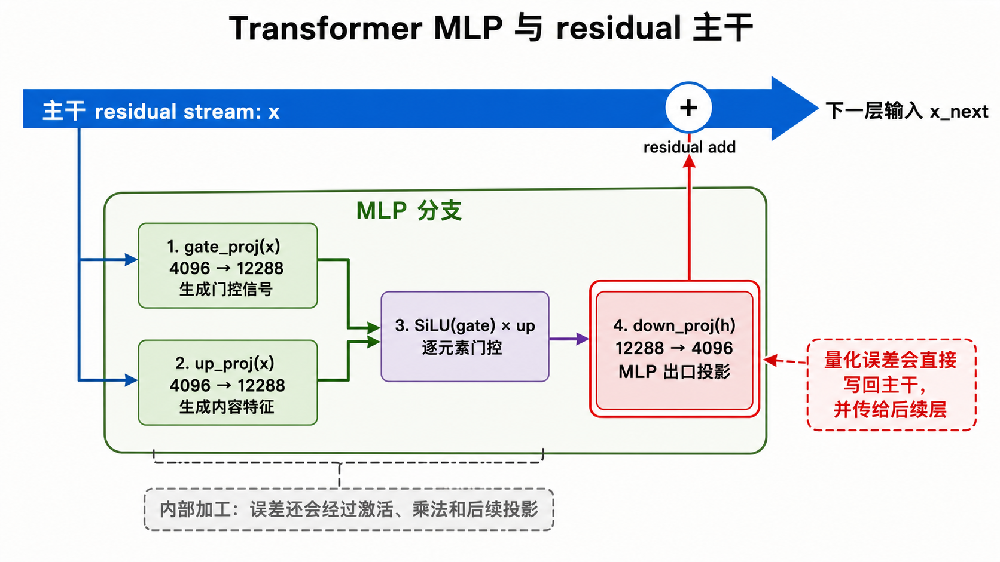
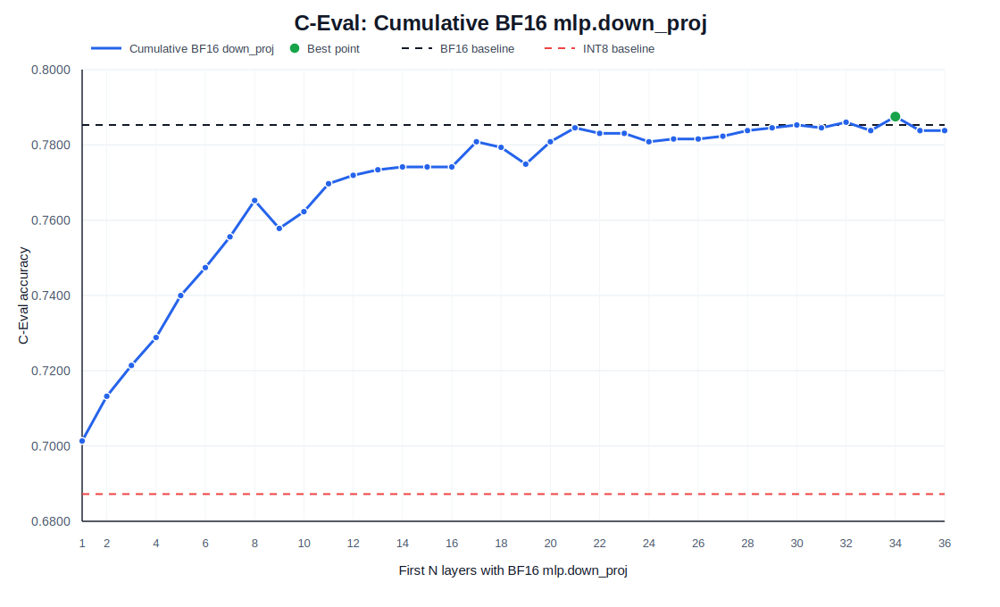
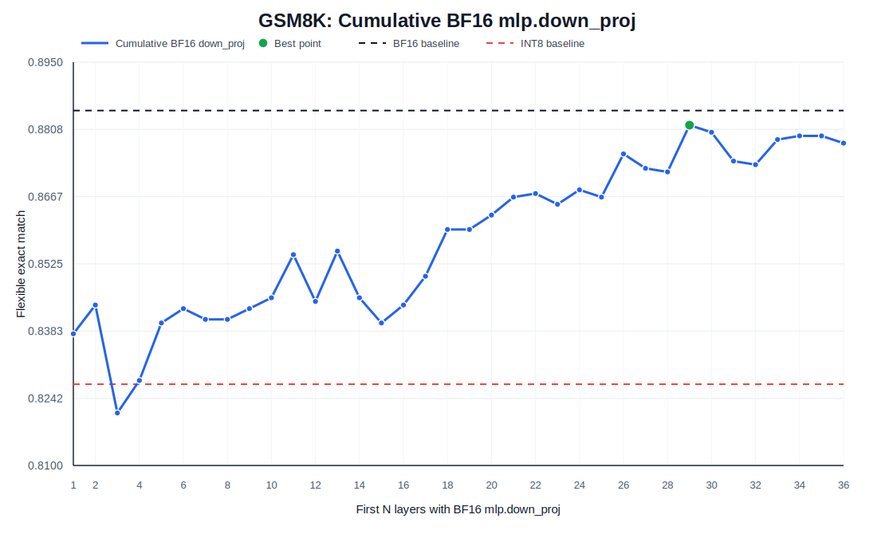
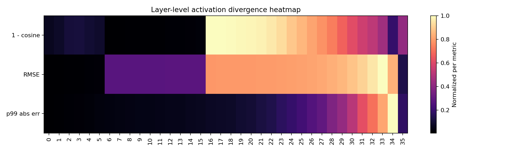
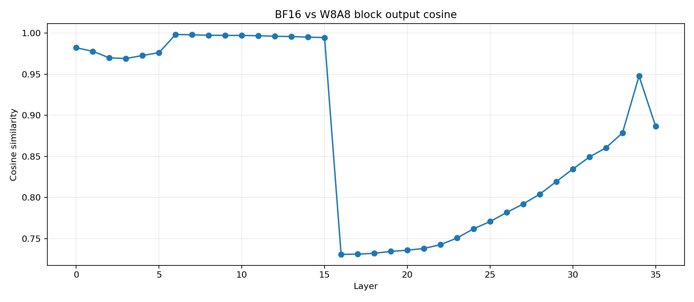

# TensorRT-LLM INT8 `mlp.down_proj` 根因分析

本文总结 Qwen3-8B 在 TensorRT-LLM / ModelOpt INT8 SmoothQuant 链路中的精度下降归因实验。

## 实验设置

- 模型：Qwen3-8B。
- 后端：TensorRT-LLM 1.0.0。
- 量化方式：ModelOpt INT8 SmoothQuant。
- 主要消融变量：将前 N 层的 `mlp.down_proj` 保持为 BF16，其余 Linear 模块继续使用 INT8。
- C-Eval 校准集：完整 C-Eval dev，260 条。
- GSM8K 校准集：完整 GSM8K train，7473 条。
- C-Eval 指标：`acc`。
- GSM8K 指标：`exact_match,flexible-extract`。

## C-Eval 与 GSM8K 为什么曲线不同

C-Eval 是多项选择题的 log-likelihood 排序任务。模型比较 A/B/C/D 选项概率时，如果正确选项和错误选项 margin 很小，量化造成的轻微扰动就可能翻转排序，因此 C-Eval 对最终 logits 更敏感。

GSM8K 是生成式数学推理任务。模型需要生成推理过程和最终数字答案，量化误差可能在生成步骤中累积；但只要最终抽取出的数字正确，表达方式不同仍可能被判对。因此 GSM8K 曲线通常比 C-Eval 更噪。

## 为什么 `mlp.down_proj` 敏感

Qwen3-8B 使用 gated MLP / SwiGLU 结构。`gate_proj` 和 `up_proj` 将 hidden states 从 4096 维扩展到 12288 维，经过门控和逐元素乘法后，再由 `down_proj` 投回 4096 维。这个投影是 MLP 分支写回 residual stream 的出口。

`down_proj` 的输入已经经过非线性门控与逐元素乘法，动态范围更复杂，也更容易携带 activation outlier。如果 `down_proj` 的 W8A8 量化误差较大，误差会直接注入 residual stream，并传递到后续层。

## C-Eval 累计消融

| 对照 / 最佳点 | C-Eval acc |
|---|---:|
| INT8 SmoothQuant baseline | 0.687221 |
| TensorRT-LLM BF16 baseline | 0.785300 |
| 最佳：前 34 层 `mlp.down_proj` 保持 BF16 | 0.787519 |
| 全 36 层 `mlp.down_proj` 保持 BF16 | 0.783804 |

C-Eval 随着更多早期 `mlp.down_proj` 保持 BF16 而稳定恢复。跳过约 30 层后，结果已经接近或达到 BF16 水平。

## GSM8K 累计消融

| 对照 / 最佳点 | GSM8K flexible |
|---|---:|
| INT8 SmoothQuant baseline | 0.827142 |
| TensorRT-LLM BF16 baseline | 0.884800 |
| 最佳：前 29 层 `mlp.down_proj` 保持 BF16 | 0.881729 |
| 全 36 层 `mlp.down_proj` 保持 BF16 | 0.877938 |

GSM8K 也整体恢复，但曲线不如 C-Eval 单调。最佳点出现在前 29 层 `mlp.down_proj` 保持 BF16，已经非常接近 TensorRT-LLM BF16 baseline。

## 支撑诊断

激活诊断最初发现 layer 16-21 漂移明显。这个现象是很好的线索，但单纯跳过这些整层只能恢复少量 C-Eval 精度。进一步的模块级消融显示：

- 所有 `mlp.down_proj` 保持 BF16 后，C-Eval 恢复到 `0.783804`。
- 所有 `self_attn.o_proj` 保持 BF16 后，仅恢复到 `0.690936`。
- 早期层的 `mlp.down_proj + self_attn.o_proj` 保持 BF16，比只跳过 layer 16-21 更有效。

## 结论

1. 累计 `mlp.down_proj` 保持 BF16 可以解释大部分 TensorRT-LLM INT8 SmoothQuant 精度损失。
2. 主要问题不是 `self_attn.o_proj`。
3. layer 16-21 是漂移显现最明显的位置，但早期 `mlp.down_proj` 量化误差更像是累积误差来源。
4. 实用方向是构建 TensorRT-LLM 混合精度 recipe：保留关键 `mlp.down_proj` 为高精度，同时继续量化其他模块。

结构化消融数据位于 [`../results/tensorrt_llm_down_proj_ablation.csv`](../results/tensorrt_llm_down_proj_ablation.csv)。
